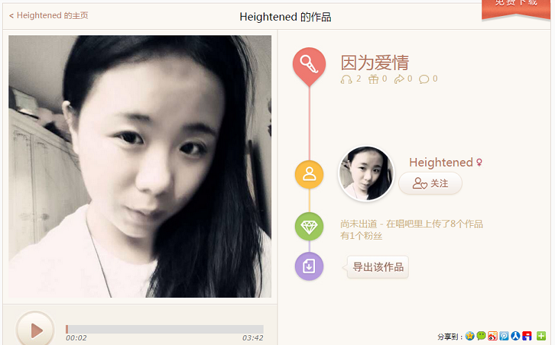

# get-changba-song

Get song data from link of changba

> As a tool of [fritx/wyu-sing](https://github.com/fritx/wyu-sing) project

## Shots



## Usage

```js
var get = require('get-changba-song')
get('http://changba.com/s/5a3bo8I38I1HydevkfyvMw', function(err, song){
  console.log(song)
})
```

```js
{
  source: 'http://upuwmp3.changba.com/userdata/userwork/208/332383208.mp3',
  name: '因为爱情',
  user: 'Heightened',
  photo: 'http://aliimg.changba.com/cache/photo/277338825_320_320.jpg',
  title: '因为爱情 - Heightened (#唱吧#录制)',
  summary: ' '
}
```
